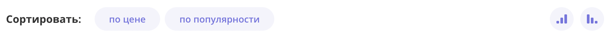
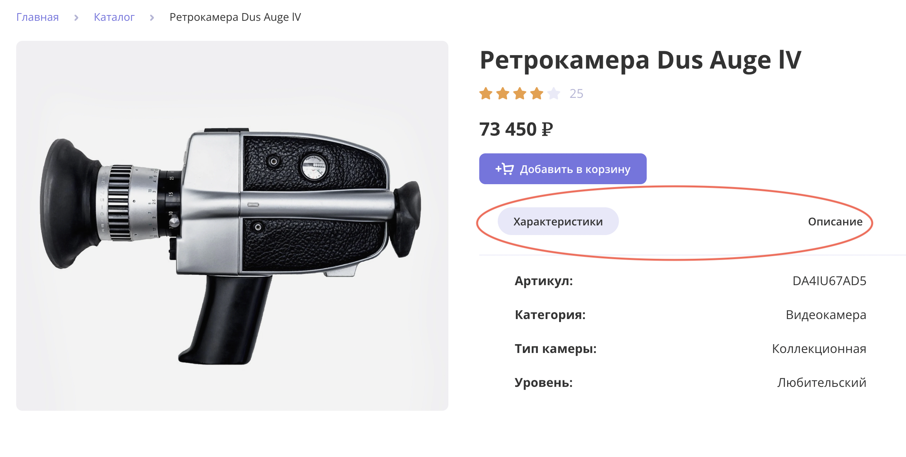

# Camera shop

Camera shop - is an online shopping service to buy video and photo cameras. 


It has a pretty user-friendly interface with a simple familiar structure. In application, you can find everything you need to find a perfect product in a short time.


There is a filters user can select. Price arrange, type of camera, professional level of camera. You can apply several filters at the same time to make you search more flexible and comfortable.



There is a sorting. You can sort cameras by price, by rating in different order. It also sums up with selected filters. So sorting is very convenient feature, because customer always pay attention on rating and especially price.



User can go to detailed information about camera by clicking a button from the main page. Every product has a block with description and features of the camera. You can toggle in tabs.


Below detailed information there is a gallery with similar offers. You can directly add the offer to cart or open detailed information from interactive gallery. 


Below the gallery you can view a list of comments with rating and add your owm comment by clicking a button on the right. 


Comment form has 5 fields to fill in, and they all are required. As soon as you click the submit button, your comment will appear at the top in the list.


You can go to cart and view cameras you selected. Also, user can apply a promo code and get the total price with discount.

## Stack
- React,
- Typescript,
- React Dom Router,
- Redux Toolkit,
- Jest,
- Axios.


## Demo site
[Go to Camera shop application >>](https://bazdyreva-camera-shop-lisabazdyreva.vercel.app/)

## How to run app locally:

- Clone repository:
```bash
git clone git@github.com:lisabazdyreva/camera-shop.git
```

- Install dependencies repository:

```bash
npm install
```

- Run application:

```bash
npm start
```

- Check tests
```bash
npm test
```
